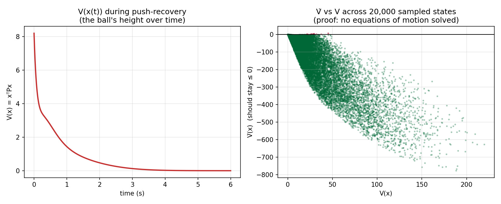
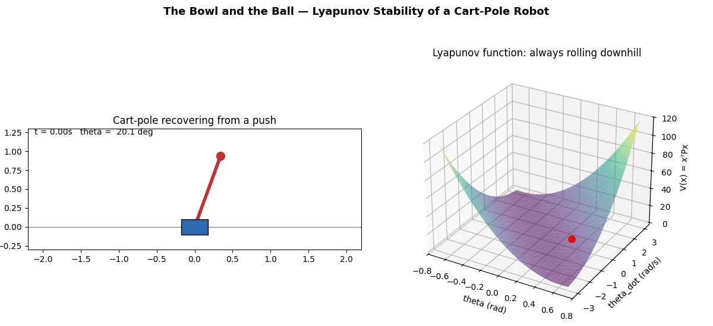

# The Bowl and the Ball

### Numerical Lyapunov verification of a cart-pole balancing controller - without solving its equations of motion in closed form

This is a self-contained control project that combines **LQR control**, a **Lyapunov function**, the **true nonlinear cart-pole dynamics**, numerical state-space sampling, and a push-recovery simulation.

The central idea is simple: use the positive-definite matrix `P` produced by the LQR Riccati equation to construct a Lyapunov candidate

`V(z) = zᵀ P z`

and then evaluate its derivative along the **true nonlinear dynamics**. The project uses numerical sampling to identify where `V̇ < 0` is observed and demonstrates recovery from a 20° disturbance.

> **Important:** This project provides **numerical evidence**, not a formal mathematical proof that stability holds for every state in a continuous region. The 20,000 samples are finite random tests, and the reported region is therefore described as a **numerically verified sublevel region**, not a rigorously certified region of attraction.

## Visual Results

### 1. Core LQR & Matrix Setup

The project defines the linearized system matrices `A` and `B`, computes the LQR solution, obtains the Lyapunov matrix `P` from the continuous-time Riccati equation, and checks the eigenvalues of the closed-loop linear system.


---

### 2. State Sampling & Numerical Lyapunov Verification

The verification script evaluates **20,000 randomly sampled states** from a four-dimensional state-space box:

- `x`: −2 to +2 m
- `x_dot`: −3 to +3 m/s
- `theta`: −0.6 to +0.6 rad (about ±34.4°)
- `theta_dot`: −3 to +3 rad/s

At every sampled state, the code calculates `V` and `V̇` using the **true nonlinear dynamics** and the LQR control law.

In this run:

- **20,000** states were sampled
- **19** samples had `V̇ >= 0` (**0.095%**)
- The violating samples occurred near the edge of the sampled angle range
- The smallest `V` among the violating samples was **21.4923**

Therefore, `V <= 21.4923` is reported here as a **numerically verified sublevel region with no sampled violations**. It should not be interpreted as a formal proof that every continuous state in that set satisfies `V̇ < 0`.


---

### 3. Stability Verification Plots

The plots summarize the sampled values of `V̇` and the Lyapunov value along the nonlinear push-recovery trajectory.

The sampling result shows where `V̇ < 0` was observed across the tested states, while the trajectory demonstrates monotonic Lyapunov decrease for the particular simulated disturbance.




---

### 4. Cart-Pole & Lyapunov Bowl Animation

The animation shows the nonlinear cart-pole recovering from an approximately **20° disturbance** while the corresponding state moves toward the minimum of the Lyapunov function.

The bowl visualization is a **2D slice/projection of the four-dimensional Lyapunov function**, used for visual intuition rather than as a complete representation of the full state space.



## What the Code Demonstrates

1. **LQR controller design** - The system is linearized around the upright equilibrium and an LQR controller is obtained from the continuous-time algebraic Riccati equation.
2. **Lyapunov candidate from LQR** - The Riccati solution `P` is used to construct `V(z) = zᵀPz`.
3. **Nonlinear verification** - `V̇` is evaluated using the actual nonlinear cart-pole equations rather than only the linearized model.
4. **State-space sampling** - 20,000 deterministic-randomly generated states are tested to look for violations of `V̇ < 0`.
5. **Numerical sublevel estimate** - The first sampled violation in terms of `V` is used to identify a conservative sublevel value with no observed violations among the tested samples.
6. **Push recovery** - A nonlinear simulation starts with the pole approximately 20° from upright and checks whether `V` decreases during recovery.
7. **Visualization** - The numerical results are turned into static plots and an animated Lyapunov-bowl visualization.

## Results from This Run

| Test | Result |
|---|---:|
| Randomly sampled states | **20,000** |
| Sampled `V̇ >= 0` violations | **19 (0.095%)** |
| Smallest `V` among sampled violations | **21.4923** |
| Push-recovery duration | **6 s** |
| Initial `V` | **8.19** |
| Final `V` | **0.00026** |
| Final angle | **≈ 0.13°** |
| `V` monotonic during this simulation | **Yes** |

The **19 violations are important**: they show that the controller/Lyapunov candidate should not be described as guaranteeing decrease over the entire ±34° sampled box. Instead, the experiment identifies a smaller region where no violations were observed in the finite sample.

## Files

| File | Purpose |
|---|---|
| `lyapunov_core.py` | Nonlinear cart-pole physics, linearization, LQR controller, and Lyapunov functions |
| `lyapunov_verify.py` | Samples 20,000 states, evaluates `V̇`, estimates the no-observed-violation sublevel, and runs push recovery |
| `lyapunov_proof_plot.py` | Generates the numerical verification plots |
| `lyapunov_animate.py` | Generates the cart-pole + Lyapunov bowl animation |
| `sim_data.npz` | Cached simulation and sampled-state data |
| `1.png` | LQR / matrix output |
| `2.png` | Numerical verification output |
| `3.png` | Stability summary plot |
| `proof_summary.png` | Stability summary plot |
| `lyapunov_animation.gif` | Animated recovery and Lyapunov visualization |

## The Core Idea

The project does **not** require solving the nonlinear equations of motion in closed form.

Instead:

1. Linearize the cart-pole near the upright equilibrium.
2. Design an LQR controller and obtain the Riccati matrix `P`.
3. Use `P` to define the Lyapunov candidate `V(z) = zᵀPz`.
4. Evaluate `V̇` numerically using the true nonlinear dynamics.
5. Test many states to find where negative Lyapunov decrease is observed.
6. Simulate a disturbed system to demonstrate practical recovery.

This makes the project a **numerical stability-analysis and visualization experiment**, rather than a formal symbolic proof of global or regional stability.

## Execution

Install dependencies:

```cmd
pip install scipy matplotlib pillow numpy
```

Run **one command at a time** in Windows Command Prompt:

```cmd
python lyapunov_core.py
```

Then:

```cmd
python lyapunov_verify.py
```

Then:

```cmd
python lyapunov_proof_plot.py
```

Finally:

```cmd
python lyapunov_animate.py
```

The final command generates:

```text
lyapunov_animation.gif
```
