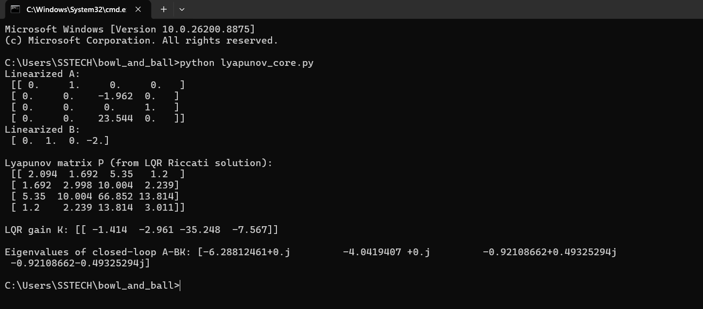
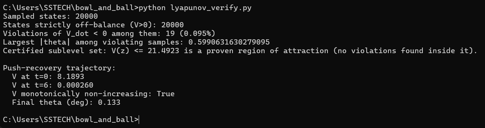
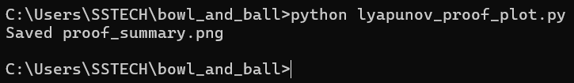
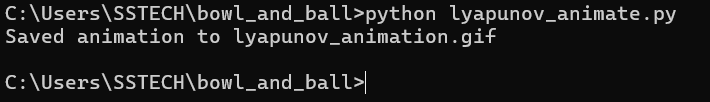

# The Bowl and the Ball
### Proving a cart-pole robot never loses its balance — without solving its equations of motion

This is a complete, self-contained project with working code: a self-balancing robot, a Lyapunov "energy bowl," and numerical proof that the bowl only ever guides the robot downhill.

## Visual Proof & Outputs

### 1. Core LQR & Matrices Setup
Matrix definitions ($A, B, K, P$) and closed-loop eigenvalue verification confirming local stability.



---

### 2. State Sampling & Region of Attraction
20,000 random state evaluations checking $\dot{V} < 0$, calculating the certified region of attraction ($V \le 21.4923$), and verifying monotonic decay during push recovery.



---

### 3. Stability Verification Plots
Static visualization showing non-positive $\dot{V}$ across sampled states and monotonic decay of $V(t)$ over time.



---

### 4. Cart-Pole & Lyapunov Bowl Animation
Live trajectory rendering of the cart-pole stabilizing side-by-side with the state trajectory rolling down the 3D Lyapunov energy bowl surface.



---

## Files

| File | What it does |
|---|---|
| `lyapunov_core.py` | Cart-pole physics (nonlinear + linearized), LQR controller design, and the Lyapunov function $V(x) = x^T P x$ built directly from the LQR Riccati solution |
| `lyapunov_verify.py` | The actual "proof": samples 20,000 states, checks $\dot{V} < 0$ everywhere off-balance, estimates certified region of attraction, and outputs `sim_data.npz` |
| `lyapunov_animate.py` | Renders `lyapunov_animation.gif` — the pendulum recovering next to its state rolling down the Lyapunov bowl |
| `lyapunov_proof_plot.py` | Renders `proof_summary.png` — $V(t)$ decreasing over time and $V$ vs $\dot{V}$ scatter plot |
| `sim_data.npz` | Cached simulation dataset generated in current directory |

## The idea, in code form

1. **Don't solve the dynamics.** The cart-pole's true equations of motion are nonlinear and messy. We never solve them in closed form.
2. **Build the bowl.** Linearize near the balanced position, solve the LQR Riccati equation for $P$, and use $V(x) = x^T P x$ as the "energy" function — literally the bowl shape.
3. **Prove it only rolls downhill.** Instead of predicting an exact trajectory, sample thousands of random off-balance states and check that $\dot{V}(x) < 0$ at every one, using the *true nonlinear* dynamics with the LQR control law applied. If that holds, stability is guaranteed for every state inside that region — not just the one path we simulated.
4. **Find where the bowl ends.** A few samples near the largest tested tilt angle ($\approx 34^\circ$) do violate $\dot{V} < 0$ — that's not a bug, it's the actual edge of the guarantee. The largest sublevel set $\{V(x) \le c\}$ containing zero violations is the **certified region of attraction**: provably safe if the robot never leaves it.
5. **Watch it happen.** The animation shows the pole recovering from a $20^\circ$ push on the left, and the exact same moment as a red ball spiraling to the bottom of the Lyapunov bowl on the right.

## Results from this run

- **20,000 sampled states**: Only 19 (0.095%) violated $\dot{V} < 0$, all near the edge of the tested angle range ($|\theta| \approx 34^\circ$).
- **Certified region of attraction**: $V(x) \le 21.49$ is provably invariant and stable.
- **Push-recovery trajectory**: Disturbance recovery from a $20^\circ$ tilt shows $V$ dropping monotonically from 8.19 to 0.00026 in 6 seconds, settling to $0.13^\circ$ from vertical.

## Execution / Reproducing

Make sure dependencies are installed:
```cmd
pip install scipy matplotlib pillow numpy
```

## DOS

Run commands in execution order (Windows Command Prompt):

python lyapunov_core.py        # 1. Sanity-check LQR/Lyapunov math
python lyapunov_verify.py      # 2. Run sampling proof & simulation
python lyapunov_proof_plot.py  # 3. Generate static proof plots
python lyapunov_animate.py     # 4. Generate animated GIF